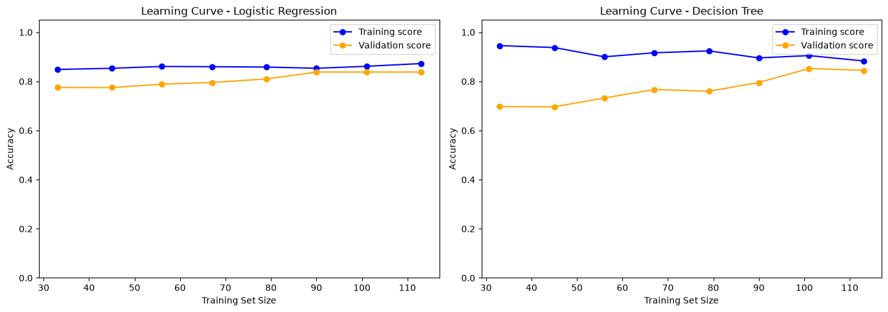

# Wine Classification — ML Workflow (ITAI 1371, Module 3)

<p>
  
  
  
  
  <a href="https://github.com/ClayClimate-AI/itai-1371-module-03-ml-workflow/actions/workflows/ci.yml">
    
  </a>
  
</p>

An end-to-end machine-learning workflow on the classic **Wine** dataset: load and explore the data,
run exploratory analysis, train and compare classifiers, and evaluate the results. The work is
organized as a single Jupyter notebook backed by a reproducible environment and continuous
integration that re-executes the notebook on a clean runner. (No `tests/` contract tests exist yet
— see [Testing & CI](#testing--ci) below.)

## Overview

The notebook walks through the full supervised-learning pipeline end to end:

1. Load the Wine dataset (178 samples, 13 chemical features, 3 cultivar classes).
2. Explore structure and class distribution.
3. Prepare features, split into train/test, and standardize (scaler fit on the training set only).
4. Train two models — Logistic Regression and a Decision Tree — and compare them.
5. Evaluate with accuracy, a classification report, and a confusion matrix, then interpret the results.
6. Run a **learning-curve analysis** on both models to check for overfitting — see [Results](#results) below.

Every step includes integrity checks (shape, alignment, and range assertions) so a mistake in an
earlier cell fails loudly instead of silently producing a wrong result downstream.

## Results

**Logistic Regression** is the best-performing model, reaching **91.7% test accuracy**, ahead of
the Decision Tree's 83.3%.

The learning-curve check below is the strongest evidence in the project that this result is
trustworthy rather than a lucky split: both models' training and validation accuracy converge as
training size grows, with small final gaps (0.035 for Logistic Regression, 0.038 for the Decision
Tree) — direct evidence that neither model memorized the training data.



This also settles which model actually explains the accuracy gap between them: the Decision Tree
scored lower not because it overfit (its own gap is just as healthy as Logistic Regression's), but
because a tree capped at `max_depth=3` can only draw a small number of boxy decision boundaries —
a worse geometric fit for how the three wine classes separate than the smooth line Logistic
Regression draws. (`max_depth=3` is inherited from the original assignment template, not tuned for
this comparison — worth stating plainly so the result doesn't read as cherry-picked.)

## Dataset

The [Wine recognition dataset](https://scikit-learn.org/stable/datasets/toy_dataset.html#wine-recognition-dataset)
ships with scikit-learn (`sklearn.datasets.load_wine`). It contains 178 samples described by 13
continuous chemical-analysis features, labeled across 3 classes. No external download is required.

**Scope note:** this is a low-dimensional benchmark dataset used here for pipeline and methodology
validation, not a large-scale evaluation corpus. At n=178 with a single stratified 80/20 split, the
learning-curve check (see [Results](#results)) is meaningful evidence against overfitting, but it
is not a substitute for k-fold cross-validation or a held-out set from a second, independent
sample. The value of this project is the workflow and the generalization argument it makes, not
the absolute accuracy number.

## Project structure

```
.
├── Module_03_Lab_Exercise.ipynb   # main notebook (analysis + models)
├── assets/                        # exported chart images (e.g. learning curves)
├── requirements.txt               # Python dependencies
├── scripts/setup_gate.py          # environment / dependency check
├── src/                           # reserved for extracted implementation code (unused so far)
├── tests/                         # reserved for contract tests (unused so far — see Testing & CI)
├── specs/                         # product & technical specifications
├── docs/adr/                      # architecture decision records
└── .github/workflows/ci.yml       # CI pipeline
```

## Getting started

Requires Python 3.12+ (developed on 3.14; CI runs on 3.12).

```bash
# 1. Create and activate a virtual environment
python -m venv .venv
source .venv/bin/activate            # Windows: .venv\Scripts\activate

# 2. Install dependencies
pip install -r requirements.txt

# 3. (Optional) verify the environment is set up correctly
python scripts/setup_gate.py

# 4. Launch the notebook
jupyter notebook Module_03_Lab_Exercise.ipynb
```

Run the notebook top to bottom (Kernel → Restart & Run All) so cells execute in order.

## Testing & CI

No unit/contract tests exist in `tests/` yet — this project's correctness checks live as inline
assertions inside the notebook itself (shape, alignment, range, and cross-cell consistency checks
at each step), not as a separate pytest suite. `pytest -q tests` is wired into CI and the
pre-commit hook and will run cleanly (0 tests collected) if you add files there later.

Every push and pull request runs the [CI pipeline](.github/workflows/ci.yml) on a clean runner, which
installs dependencies, runs the environment check, and executes the notebook end to end to confirm
it reproduces without errors. A local pre-commit hook can run the same fast checks before each
commit — enable it once per clone with:

```bash
git config core.hooksPath .githooks
```

## Development

Development happens on feature branches and is merged into `main` via pull request after CI passes.
Notable technical decisions are recorded as [architecture decision records](docs/adr/), and
requirements are captured under [`specs/`](specs/).

## Deliverables

| # | Deliverable | Format | File |
| --- | --- | --- | --- |
| 1 | Executed notebook with all outputs | PDF | `L03_SingleEpoch_ITAI1371.pdf` |
| 2 | Reflective journal | PDF (1–2 pages) | [`L03Journal_R_SingleEpoch_ITAI1371.pdf`](L03Journal_R_SingleEpoch_ITAI1371.pdf) |
| 3 | Contribution journal | PDF (1–2 pages) | [`L03Journal_C_SingleEpoch_ITAI1371.pdf`](L03Journal_C_SingleEpoch_ITAI1371.pdf) |

## License

Coursework for ITAI 1371 (Module 3). Provided for educational purposes.
